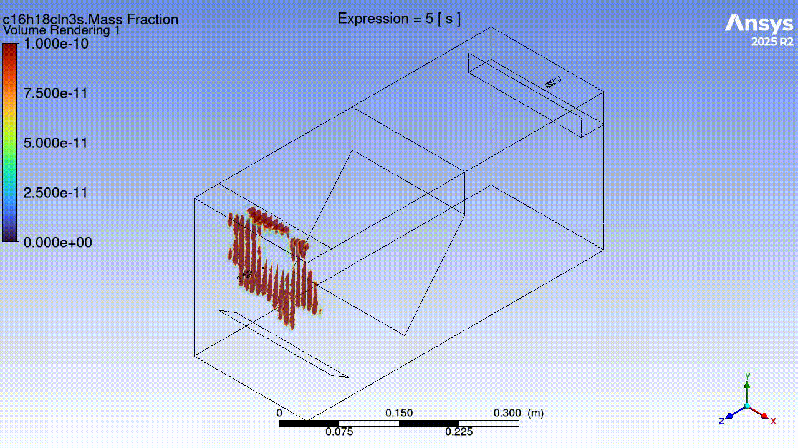

# Hydraulic Design and CFD Optimization of a Bench-Scale Sedimentation Basin

> **Note on Documentation:** This project was executed at the Institute of Urban and Industrial Water Management, TUD Dresden University of Technology.

---

## Project Overview
- **Institution:** TUD Dresden University of Technology (Faculty of Environmental Sciences)
- **Core Methodology:** Physical Tracer Stimulus-Response Experiments paired with 3D Fluid Modeling
- **Software Framework:** ANSYS Fluent (Design Modeller & CFD-Post), FIJI/ImageJ (Image Processing)
- **Key Competencies:** Computational Fluid Dynamics (CFD), Finite Volume Method (FVM), Residence Time Distribution (RTD) Analysis, Geometric Baffle Optimization, Lab-scale Experimental Validation

---

## The Engineering Challenge (The "Why")
Sedimentation basins are foundational unit processes in water purification and wastewater treatment, relying entirely on gravitational forces to settle out suspended solids. However, ideal plug-flow conditions are rarely achieved in reality. Real-world basins face severe hydraulic inefficiencies caused by internal flow short-circuiting, large stagnant dead zones, and secondary recirculation loops. These non-ideal hydrodynamics waste active tank volume and impair the clarification efficiency.

The objective of this study was to combine physical laboratory diagnostics with high-fidelity 3D numerical simulations to quantify these flow anomalies within a 23.46-liter bench-scale basin, optimize its volumetric capacity through internal geometric modifications (baffles), and evaluate critical operating condition trade-offs.

---

## Integrated Methodology & Technical Workflow (The "How")

My contribution focused heavily on the engineering pipeline: leading the experimental setup, creating digital extraction workflows, configuring the numerical solvers, and evaluating mesh dependency.

### 1. Physical Lab Diagnostics & FIJI Image Processing
- **Stimulus-Response Testing:** Operated a clear plexiglass basin model at a steady-state volumetric discharge of 460 mL/min, injecting a pulse of Methylene blue dye tracer to evaluate residence behavior.
- **Optical Proxy Extraction:** Built a frame-by-frame image processing script in FIJI (ImageJ) to extract mean light intensity as a proxy for chemical concentration (conforming to the Beer-Lambert Law).
- **Signal Optimization:** Configured adaptive frame-rate video extraction (up to 1 FPS for initial jets), split color channels to isolate the highly sensitive red spectrum, applied image inversion, and executed steady-state background subtractions to remove wall reflection noise.

### 2. Numerical 3D CFD Modeling (ANSYS Fluent)
- **Geometric Discretization:** Replicated the exact 526 mm x 200 mm x 243 mm experimental dimensions using ANSYS Design Modeller.
- **Mesh Independence Study:** Evaluated grid sensitivity across five spatial densities. Solved the independent threshold by generating an optimized **773,744 tetrahedral finite-volume mesh** with localized inflation layers near solid boundaries.
- **Solver & Species Physics Configuration:** Developed a single-phase, steady-state laminar flow regime, justified by a calculated peak inlet Reynolds Number (\(Re = 1394\)) remaining safely beneath the turbulent limit (\(Re < 2000\)).
- **Boundary Controls:** Implemented a free-slip symmetry top boundary condition to model open-air water surface behavior and resolved the transient transport equations to track mass-fraction elution profiles at the outlet grid.

---

## Technical Visual Gallery & Research Results

### 1. Lab Setup & Digital Grid Configuration
The study synchronized a physical fluid testing rig (left) with a high-integrity numerical mesh grid framework (right) to evaluate hydrodynamic boundary responses:

| Physical Laboratory Experimental Rig | Finite Volume Method (FVM) Mesh Domain |
|---|---|
|  |  |

### 2. Quantitative Model Validation & Hydraulic Metrics
The numerical model achieved high quantitative agreement with physical observations, restricting relative error to **< 6% for Mean Residence Time** and **< 12% for Peak Exit Time**. 

Adding an internal deflector baffle flattened the initial breakout peak and drastically stretched out the washout tail, recovering lost retention capacity:

### 3. Qualitative Tracer Transport Comparison
The physical dye propagation photographs matched the 3D computational species volume rendering profiles across key temporal milestones. At \(t = 5\text{ min}\), both domains visually confirm the fluid plume deflecting downward below the baffle edge before rising into the primary settling core:

---

---

## 💡 Key Takeaway & Professional Competencies
This academic study project reflects my practical approach to solving complex environmental and industrial engineering problems:

- **Rigorous Cross-Validation Framework (QA/QC):** By coupling physical laboratory stimulus-response data with numerical finite-volume calculations, I ensured the digital model wasn't just a "visual approximation" but a statistically validated framework (limiting Mean Residence Time error to <6%). I know that utility in modeling depends entirely on anchoring math against physical reality.
- **Computational Resource Efficiency:** I calculated the system's true hydrodynamic parameters analytically first to prove the flow regime was purely laminar (\(Re = 1394\)). This allowed me to safely deactivate unnecessary solver models (like the conservation of energy equation), saving significant High-Performance Computing (HPC) cluster memory and processing time without sacrificing data integrity.
- **Operational Trade-off Evaluation:** The discovery of the Morrill Dispersion Index penalty (where increasing flow sweeps dead zones but severely ruins overall retention efficiency from 2.57 up to 7.71) reflects my systems-thinking mindset. I focus on analyzing the downstream consequences of an operational change, allowing me to deliver balanced, structural solutions rather than temporary fixes.

---

## 🔒 Intellectual Property & Open-Source Exception Notice
To protect the novelty and intellectual property of this upcoming peer-reviewed publication, the raw configuration assets are withheld from open-source distribution. Full replication materials will be made available upon formal journal acceptance.

