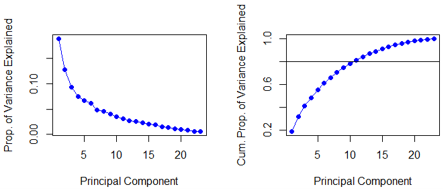

# Statistical Learning for Earth System Sciences: Predictive Modeling & Advanced Spatial Hypothesis Testing

> **Note on Documentation:** The full academic project report is available as a PDF in the `documentation/` folder, and the executable deployment scripts are located in the main directory (`.R` files). This study was executed under the Module "Statistical Learning" at TUD Dresden University of Technology.

---

## Project Overview
- **Core Focus:** High-Dimensional Crop Yield Prediction & Multi-Location Climate Trend Modeling
- **Programming Language:** R (Advanced scripting framework)
- **Primary Packages:** `leaps` (Best Subset Selection), `glmnet` (Lasso Regression), `ncdf4` (NetCDF Raster Management), `fields` (Spatial Mapping)
- **Key Competencies:** Principal Component Analysis (PCA), Statistical Data Profiling (i.i.d. Verification), High-Dimensional Feature Selection, Spatial Multiple Testing Corrections (False Discovery Rate)

---

## The Analytical Challenge (The "Why")
Earth system and environmental data are inherently complex, featuring high dimensionality, massive spatial dependence, and non-ideal data distributions. This data science project resolves two distinct mathematical challenges using advanced statistical learning frameworks in R:

1. **Task 1: Crop Yield Predictive Framework:** Building a localized predictive model for crop yields utilizing **23 climate predictors across 1,500 continuous observations**. The model must handle severe multicollinearity, detect spatial data leakage, and systematically select the most high-integrity predictor features.
2. **Task 2: Large-Scale Climate Anomaly Detection:** Evaluating historical trend slopes for temperature and precipitation networks across **25,600 unique gridded data points spanning Europe**. The challenge lies in executing robust statistical hypothesis testing across multiple coordinates without generating catastrophic rates of False Positives.

---

## Computational & Methodological Workflow (The "How")

### 1. Multivariate Data Profiling & Dimensionality Reduction
- **PCA Decomposition:** Applied Principal Component Analysis (PCA) on standardized fields to isolate multi-variable colinearities, demonstrating that **11 principal components can capture >80% of the variance** across the 23 environmental predictors.
- **i.i.d. Assumption Testing:** Conducted two-way ANOVA profiling, proving that the dataset is neither temporally nor spatially identically distributed (Extremely low p-values = 2 × 10⁻¹⁶). 
- **Spatiotemporal Independence Check:** Deployed Auto Correlation Functions (ACF) up to 5-year lags to verify temporal independence, paired with spatial cross-correlation matrices to quantify geographic dependency blocks exceeding a 0.7 coefficient threshold.

### 2. High-Dimensional Regression Modeling & Cross-Validation
- **Best Subset Selection:** Configured rigorous linear evaluations up to the maximum column bounds (`nvmax`), tracking diagnostic indicators (MSE, R², adjusted R², \(C_p\), and BIC) across every variable layer.
- **Lasso Regularization:** Configured a shrinkage model utilizing a 5-fold cross-validation architecture (`cv.glmnet`) to isolate the optimal tuning penalty (\(\lambda_{\text{min}}\)).
- **Data Leakage Mitigation:** Evaluated and compared two data splitting architectures: a standard 50-50 **Random Split** versus a strict temporal **Even-Uneven Years Split** designed to completely eliminate temporal data leakage.

### 3. Spatial Multiple Testing & False Discovery Rate (FDR) Corrections
- **NetCDF Processing:** Extracted raster coordinates and historical time-series matrices directly from multi-gigabyte `.nc` climate files utilizing the `ncdf4` library.
- **Linear Trend Fitting:** Ran high-throughput looping regressions to compute historical trend slopes and raw p-values at every single coordinate cell.
- **Benjamini-Hochberg (BH) Control:** Implemented multiple testing corrections using the Benjamini-Hochberg method (q = 0.1) to strictly clamp the maximum Expected False Positives across the massive grid network, filtering real climate signals out of background noise.

---

## Technical Visual Gallery & In-Depth Matrix Outputs

### 1. Multivariate Profiling & Dimensionality Diagnostics
We map the variance decomposition via Scree plots (left), revealing the exact threshold where 11 independent elements dominate the system. The spatial correlation matrix (right) highlights high geographic dependency blocks (>0.7) among neighboring coordinate grids:

| Principal Component Analysis (Variance Share) | Inter-Location Spatial Correlation Matrix |
|---|---|
|  |  |

### 2. Regularized Regression & Validation Performance
To optimize model performance, 5-fold cross-validation curves isolate the exact λ penality bound (left). Plotting the final predicted values against observed crop yields (right) confirms high predictive accuracy (R² = 0.63 - 0.68) for both Best Subset and Lasso architectures:

| Lasso Shrinkage λ Tuning Curve | Predicted vs. Observed Crop Yield Slopes |
|---|---|
|  |  |

### 3. Statistically Certified Spatial Climate Trends
After applying Benjamini-Hochberg corrections, the final gridded maps filter out non-significant trends. The visualization reveals a highly significant warming trend spread across almost the entire European territory, while significant precipitation increases are strictly concentrated in Northern Europe:

---

## Key Takeaway & Professional Competencies
This script-driven project directly demonstrates my practical data science and machine learning capabilities:
- **Statistical Integrity Frameworks:** Deeply aware of data quality risks, such as spatial data leakage during random train-test splitting of time-series data. I know when to implement specialized cross-validation strategies (like Even-Uneven temporal splitting) to secure realistic predictive performance (MSE = 4.03, R² = 0.52).
- **High-Throughput Scripting in R:** Proficient in writing optimized data-wrangling loops, automating matrix transformations (`reshape`), managing multidimensional NetCDF arrays, and configuring machine learning libraries (`glmnet`, `leaps`).
- **Advanced Spatial Analytics:** Skilled in navigating the complexities of large-scale geographic grids and implementing rigorous multiple-testing control constraints (Benjamini-Hochberg) to ensure that 90% of identified spatial anomalies reflect true physical signals.

