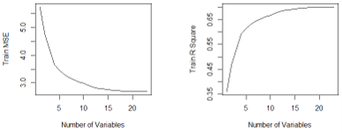

# Statistical Learning for Earth System Sciences: Dimensionality Reduction, Feature Selection & Multiple Testing

> **Note on Documentation:** The full academic project report is available as a PDF in the `documentation/` folder, and the source code is located in the main directory (`.R` files). This study was executed under the Module "Statistical Learning" at TUD Dresden University of Technology.

---

## Project Overview
- **Core Focus:** Predictive Modeling & Automated Variable Reduction
- **Programming Language:** R
- **Primary Packages:** `leaps` (Best Subset Selection), `glmnet` (Lasso Regression), `ncdf4` (NetCDF Raster Management), `fields` (Spatial Mapping)
- **Key Competencies:** Principal Component Analysis (PCA), Feature Selection, Temporal Data Leakage Mitigation, False Discovery Rate (FDR) Control

---

## The Analytical Challenge (The "Why")
Earth system datasets frequently suffer from the "curse of dimensionality"—featuring an excessive number of environmental predictors that exhibit severe multicollinearity and spatial dependency. This data science project resolves two major bottlenecks:
1. **Task 1: Predictive Model Optimization:** Building a model to predict crop yields utilizing **23 climate predictors**. The model must strip away redundant variables without sacrificing predictive accuracy.
2. **Task 2: Spatial Signal Filtering:** Statistical trend mapping across **25,600 gridded data points across Europe** without accumulating catastrophic rates of false anomalies.

---

## The Technical Core: Variable Reduction & Feature Selection

The heart of this project lies in systematically identifying and extracting only the most critical data features using two distinct reduction frameworks in R:

### 1. Unsupervised Reduction: Principal Component Analysis (PCA)
- **The Problem:** The initial dataset contains 23 separate climate predictors across 1,500 samples, making standard regression models highly unstable due to multi-variable collinearity.
- **The Reduction Mechanism:** Applied PCA on standardized predictor fields to compress the data space into orthogonal components.
- **The Result:** The variance decomposition proved that **only 11 principal components are required to capture 80% of the variance** in the system, cutting the required data dimensions by more than half.

### 2. Supervised Selection: Best Subset Regression vs. Lasso
- **The Mechanism:** Using the `leaps` library, the system evaluated every single combination of variables up to the maximum column bounds (`nvmax = 23`), checking metrics across training and validation sets.
- **Mitigating Data Leakage (The Split Trade-off):**
  - *Random Splitting (50-50):* Selected **22 variables** (eliminating only `temp_1`). However, this suffered from temporal data leakage because neighboring years share near-identical features.
  - *Strict Temporal Splitting (Even-Uneven Years):* By strictly separating the timeline, **Best Subset selection drastically reduced the data space down to just 12 critical variables** (`pr_2`, `pr_3`, `rad_2`, `rad_3`, `temp_2`, `temp_3`, `temp_4`, `temp_5`, `temp_6`, `warm_day`, `max_temp`, `max_5day_pr`).
- **The Insight:** Lasso regression failed to reduce the feature space under temporal splitting (keeping all 23 variables) because it tends to distribute weights across correlated groups. Therefore, **Best Subset combined with temporal splitting** proved superior for isolating the true minimum set of physical predictors.

### 3. Spatial Multiple Testing: Benjamini-Hochberg (BH) Control
- **The Mechanism:** Processed 25,600 data points from raw NetCDF files. To prevent widespread false alarms caused by running thousands of independent linear regressions across Europe, the Benjamini-Hochberg method (q = 0.1) was enforced.
- **The Result:** The BH multiple testing correction successfully filtered out background noise, confirming that warming trends are dominant across almost the entire European territory, while significant precipitation increases are strictly concentrated in Northern Europe.

---

## Technical Visual Gallery & Matrix Outputs

### 1. PCA Variance & Spatial Correlation Matrix
The Scree plots (left) visualize the variance accumulation, highlighting the exact boundary where 11 principal components dominate. The correlation matrix (right) explains *why* reduction is possible, mapping dense dependency blocks (>0.7) among the locations:

| Principal Component Analysis (80% Variance Bound) | Inter-Location Spatial Correlation Matrix |
|---|---|
|  |  |

### 2. Best Subset Variable Minimization Workflow
These diagnostic curves track the training behavior (left) and cross-validation behavior (right) against the number of features. The red dot on the validation plot marks the optimized model boundary where adding more variables no longer yields data improvements, proving how Best Subset strips away the 11 redundant variables:

| Training Data Performance (MSE & R²) | Test Data Validation Bounds (Best Size Optimization) |
|---|---|
|  |  |

### 3. Spatial Climate Signal Filtering
The final gridded maps display only the areas that possess statistically certified historical trends after filtering via the Benjamini-Hochberg multiple-testing framework:

---

## Key Takeaway & Professional Competencies
This script-driven project directly demonstrates my practical data science capabilities:
- **Strategic Feature Selection:** Proficient in applying rigorous mathematical constraints (PCA and Best Subset selection) to strip away redundant data and find the absolute minimum set of variables needed for a high-integrity predictive model.
- **Statistical Risk Awareness:** Deeply aware of time-series hazards such as temporal data leakage, and experienced in configuring strict validation splits (Even-Uneven years) to ensure model stability in real-world scenarios.
- **Advanced Spatial Analytics:** Skilled in writing optimized data-wrangling loops in R to handle multidimensional NetCDF arrays and implementing False Discovery Rate adjustments to extract true anomalies from noisy geographic grids.
