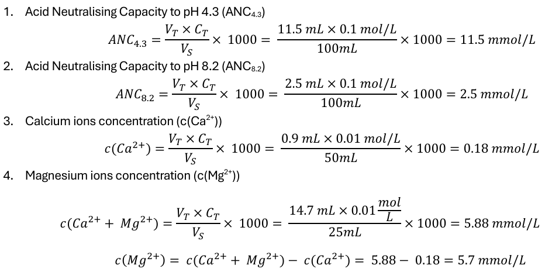
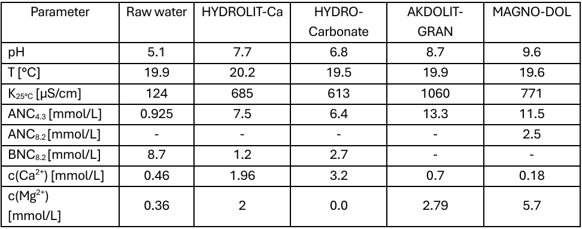
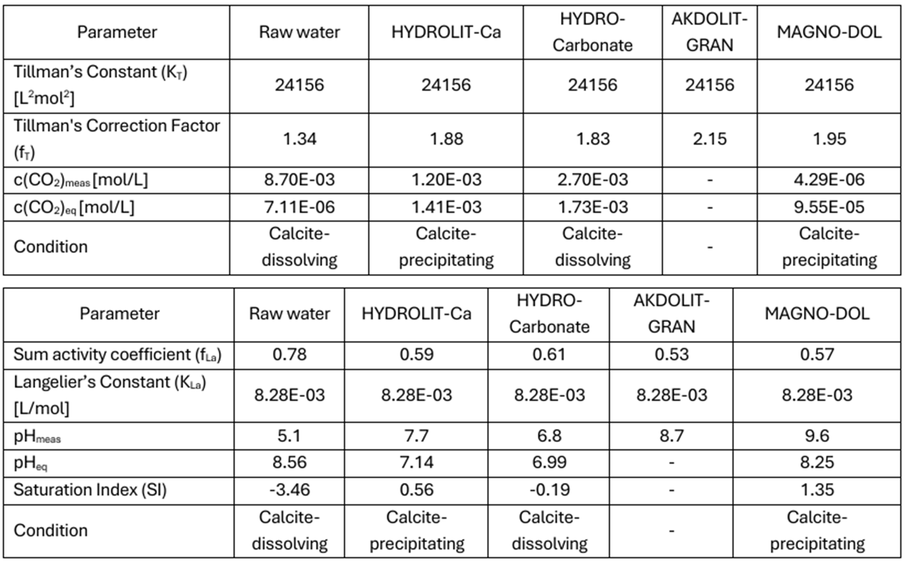

# Water De-acidification Process Engineering: Hydrochemical Equilibrium & Regulatory Compliance

> **Note on Documentation:** The full academic laboratory report is available as a PDF in the `documentation/` folder. This project was executed within the Module MHSE08 "Hydrochemistry" at TUD Dresden University of Technology.

---

## Project Overview
- **Core Focus:** Process Engineering for Drinking Water Generation & Calco-Carbonic Equilibrium
- **Methodological Framework:** Titrimetric Quantification (ANC/BNC), Saturation Index (SI) Modeling
- **Theoretical Core:** Tillman’s and Langelier’s Thermodynamic Equations
- **Regulatory Benchmark:** German Drinking Water Ordinance (*Trinkwasserverordnung - TrinkwV*)
- **Key Competencies:** Multi-Reactor Bench Evaluation, Mass-Balance Stoichiometry, Chemical Quality Assurance, Managing Incomplete Datasets

---

## The Engineering Challenge (The "Why")
Raw groundwater extracted for drinking water treatment often exhibits highly acidic and corrosive characteristics due to dissolved aggressive carbon dioxide (\(CO_2\)). Corrosive water actively dissolves calcite structures and damages industrial distribution piping networks. 

The objective of this engineering lab project was to evaluate the suitability and relative de-acidification efficiency of four commercial filter materials: two calcium carbonate-based spheres (**HYDROLIT-Ca** and **HYDRO-Carbonate**) and two semi-burnt dolomites (**AKDOLIT-GRAN** and **MAGNO-DOL**). The ultimate goal was to mathematically verify which material safely shifts highly corrosive raw water into a stable **Calco-carbonic equilibrium** while complying with strict German national drinking water standards (*TrinkwV*).

---

## Process Workflow & Quantitative Modeling (How I did it)

The testing sequence was executed using a parallel configuration of four standalone column reactors mimicking full-scale water treatment plant operations:

### 1. Titrimetric Quantification & Ion Analysis
- Operated **Reactor 4 (MAGNO-DOL filter medium)** to monitor neutralization kinetics.
- Conducted acid-base titrations to compute **Acid Neutralizing Capacity (\(ANC_{4.3}\))** and **Base Neutralizing Capacity (\(BNC_{8.2}\))** to establish total carbonate hardness distributions.
- Measured absolute concentration layers of Calcium (\(c(Ca^{2+})\)) and Magnesium (\(c(Mg^{2+})\)) using complexometric EDTA titrations to trace mineralization dissolution rates.

### 2. Thermodynamic Equilibrium Modeling
- Calculated ionic strength (\(I\)) across all reactor outputs based on electric conductivity parameters (\(\kappa_{25^\circ\text{C}}\)) to determine spatial activity coefficients via the Debye-Hückel extension.
- Resolved **Tillman’s Equation** to compute the theoretical equilibrium carbon dioxide concentration (\(c(CO_2)_{eq}\)).
- Resolved **Langelier’s Equation** to calculate the equilibrium pH (\(pH_{eq}\)) and isolate the final **Saturation Index (SI)**:
  \[SI = pH_{meas} - pH_{eq}\]

### 3. Data Constraint Management (Handling Incomplete Data)
- Encountered a realistic laboratory constraint where the \(ANC_{8.2}\) data for the AKDOLIT-GRAN reactor group was compromised.
- Diagnosed the mathematical consequences: documented that while a definitive saturation index calculation was blocked due to missing bicarbonate/carbonate ion splitting, a high-accuracy evaluation could still be deduced by cross-referencing the baseline pH indicators against the MAGNO-DOL matrix.

---

## Technical Visual Gallery & In-Depth Data Matrices

### 1. Mass-Balance & Titration Formulations
Below is the calculation matrix utilized to translate raw titrator volumes into exact millimolar concentrations of alkaline earth metals and neutralizing capacities:

### 2. Consolidated Reactor Performance Output
The experimental datasets from all parallel filter reactors were collected and standardized against the baseline corrosive raw water parameters:

### 3. Thermodynamic Saturation Inversions
By modeling Tillman's and Langelier's boundary layers, the exact water saturation index (SI) was isolated to verify whether the treated water remains calcite-dissolving, calcite-saturated, or calcite-precipitating:

---

## Key Takeaway & Professional Competencies
This chemical process project reflects my comprehensive analytical and regulatory capabilities:

- **Strict Regulatory Alignment:** Accustomed to evaluating engineering metrics against national legal frameworks. I successfully isolated that while MAGNO-DOL efficiently strips aggressive \(CO_2\), its rapid kinetic reaction drives the effluent to an excessive pH of 9.6, violating the **German Drinking Water Ordinance maximum limit (pH 6.5 – 9.5)**. I designed the operational correction: systematically reducing water-to-medium contact time to safely stabilize the output beneath the regulatory threshold.
- **Thermodynamic Systems Thinking:** Proficient in using multi-parameter chemical thermodynamic equations (Tillman/Langelier) rather than relying on raw pH alone to diagnose water stability and predict scale-forming or corrosive behaviors in distribution infrastructure.
- **Analytical Problem Solving:** Capable of maintaining high-integrity operations and extracting valid engineering insights even when working around fragmented or compromised datasets (as demonstrated in the AKDOLIT-GRAN constraint analysis).

