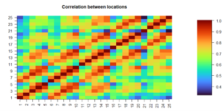
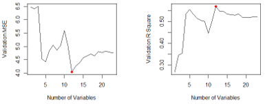
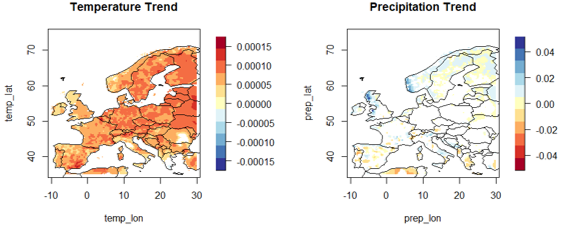

# Statistical Learning for Earth System Sciences: Crop Yield Regression and Climate Trend Testing

My exam report for the course *Statistical Learning for Earth System Sciences*, M.Sc. Hydro Science and Engineering, TU Dresden. Two tasks: predicting crop yield from climate variables, and testing for temperature and precipitation trends at many locations. Course data are not included.

---

## Project overview

| | |
|---|---|
| **Task 1** | Crop yield data: 23 predictors, 1,500 samples, 25 locations. PCA, a check of the i.i.d. assumption, best subset regression and lasso with two ways of splitting the data |
| **Task 2** | Climate data: 25,600 locations, of which 12,041 have data. Trend fitting at every location, and single against multiple testing (Benjamini–Hochberg) |
| **Methods** | PCA, ANOVA, autocorrelation function, correlation matrix, best subset regression, lasso with cross-validation, false discovery rate |
| **Tools** | R with `leaps` (best subset, up to 23 variables), `glmnet` (lasso), `ncdf4` (NetCDF climate data) and `fields` (maps) |

---

## Task 1: crop yield

### Principal components
Eleven principal components are enough to explain at least 80% of the variance of the 23 predictors.

### Is the data i.i.d.?
Regression with a random split assumes independent, identically distributed samples, so I tested it:

| Test | Result | Meaning |
|---|---|---|
| ANOVA over time and over space | p ≈ 2 × 10⁻¹⁶ for both | The data are not identically distributed |
| Autocorrelation per location (lags 0–5 years) | Almost all lags inside the significance bounds | Little dependence between years at one location |
| Correlation matrix between locations | Most values above 0.7 | Locations depend on each other, probably because they are close or similar |

My conclusion is that the data are not i.i.d.

### Two ways to split the data
I fitted best subset regression and lasso (cross-validated) with two splits into equal training and test sets:

1. **Random split** (seed 99).
2. **Even against uneven years**, so that training and test years are strictly separated in time.

| Method | Split | Selected variables | Test MSE | Test R² |
|---|---|---|---|---|
| Best subset | Random | 22 | 3.241 | 0.636 |
| Best subset | Even/uneven years | 12 | 4.034 | 0.528 |
| Lasso | Random | 22 | 3.237 | 0.637 |
| Lasso | Even/uneven years | 23 | 4.711 | 0.449 |

**Conclusion:** I prefer best subset regression with the even/uneven split. With a random split, the test set contains years next to the training years, so the test error looks better than it will be on new years (temporal leakage). The even/uneven split gives a higher error, but it is the honest one, and best subset needs only 12 variables. Lasso did worse on this split. My explanation is that its continuous shrinkage spreads weight over correlated predictors instead of dropping redundant ones; I did not test this.

---

## Task 2: climate trends

For every location I fitted a linear trend of annual temperature and annual precipitation. Annual temperature ranges from −6.98 °C to 24.73 °C, annual precipitation from 0 to 4,938 mm. Testing a trend at thousands of locations produces many false positives, so I compared two approaches:

| Number of locations with a significant trend | Single tests (α = 0.05) | Benjamini–Hochberg (q = 0.1) |
|---|---|---|
| Temperature | 11,734 | 11,778 (+44) |
| Precipitation | 4,880 | 4,633 (−247) |

- **Temperature:** the trend is significant almost everywhere in Europe, even after correcting for multiple tests. The signal is strong and widespread.
- **Precipitation:** significant trends are concentrated in northern Europe, and the multiple-testing correction removes a few hundred. The signal is noisier and less widespread.
- **Why Benjamini–Hochberg:** it controls the expected share of false discoveries among the significant results at 10%, which a single test at α = 0.05 does not do when thousands of locations are tested. I recommend it for spatial data.

## Visual gallery

### PCA and correlation between locations

| Principal components (80% variance) | Correlation matrix of the 25 locations |
|---|---|
|  |  |

### Best subset regression, random split
Training curves (left) and test curves (right) against the number of variables. The test curves give the model size with the lowest test error.

| Training data (MSE and R²) | Test data (MSE and R²) |
|---|---|
|  |  |

### Significant trends (Benjamini–Hochberg)


## Limitations

- The report has no sensitivity analysis of the seed, the split or the number of folds.
- Each split was done once, so the test errors have no uncertainty estimate.
- The trend test is a linear trend per location; I did not check spatial dependence between neighbouring locations in the trend test, although Task 1 shows strong spatial correlation.
- The explanation for the weaker lasso results is a hypothesis.

## Skills shown

- Checking the assumptions of a model before using it (i.i.d. tests).
- Choosing a validation split that matches the structure of the data, and explaining why a random split is optimistic.
- Variable selection with best subset regression and lasso.
- Multiple testing correction for spatial data.

## Folder contents

```text
.
├── README.md
├── *.R              # R scripts
├── documentation/   # the report (PDF); remove the cover page first
└── assets/          # figures used in this README
```

## Author

Fashli Adli Wal Ikhsan · [github.com/fashliadli](https://github.com/fashliadli)
